<div align="center">



<a href="https://itsmearundas-github-io.vercel.app/"></a>
<a href="https://linkedin.com/in/itsmearundas-kunnel"></a>
<a href="mailto:itsmearundasofficial@gmail.com"></a>
<a href="https://leetcode.com/itsmearundas"></a>

<br/><br/>


</div>


## 🧭 About Me

I'm **Arun Das**, a recently graduated **MCA (2026)** from **Mar Athanasius College of Engineering (MACE), KTU**, working at the intersection of **AI/ML** and **full-stack web development**. I like turning research-grade models into products people can actually click on — a two-stage YOLOv8 + EfficientNet detection pipeline, a Random Forest credit-risk system with SHAP-ready interpretability, and an AI journaling platform that argues back using your own blind spots. Every project below is deployed and live.

```yaml
role:        MCA Graduate (2026) & Software Developer
focus:       [AI/ML Integration, Full-Stack Web, Deep Learning]
location:    Kattappana, Idukki, Kerala, India
status:      🟢 Open to Full-time Opportunities & Collaborations
currently:   Shipping intelligent, deployed web applications
```


## 🛠️ Tech Stack

<div align="center">

<br/><br/>


<br/><br/>


</div>


## 🚀 Featured Projects

<table>
<tr>
<td width="50%" valign="top">

### 🌐 Portfolio Website
*Personal Engineering Portfolio — React + Vite*

Hand-coded portfolio with a custom dark design system, PDF-embedded academic timeline, bento-grid skills layout, and scroll-driven section transitions. The entry point for every job application.

**Stack:** React · Vite · JavaScript · Custom CSS Design System

<a href="https://itsmearundas-github-io.vercel.app/"></a>
<a href="https://github.com/itsmearundas/itsmearundas.github.io"></a>

</td>
<td width="50%" valign="top">

### 💰 ExpenseTracker — Personal Finance Manager
*Full-stack Flask · 2025*

A full personal finance tracker — Flask + SQLite backend, vanilla JS frontend with real-time CRUD and category-based spend analytics. Became the technical centerpiece of a full interview loop at an AI product company.

**Stack:** Python · Flask · SQLite · JavaScript · HTML5 · CSS3

<a href="https://expensetracker-33dk.onrender.com/"></a>
<a href="https://github.com/itsmearundas/ExpenseTracker"></a>

</td>
</tr>
<tr>
<td colspan="2" valign="top">

### 🔬 Hybrid Object Detection & Classification
*Two-stage deep learning pipeline — Jan–Mar 2026*

YOLOv8n for real-time object localisation + a fine-tuned EfficientNet-B0 classifier, with ByteTrack for multi-object tracking. A React frontend switches between image, video, and live webcam modes with zero page refreshes.

**Stack:** Python · YOLOv8n · EfficientNet-B0 · ByteTrack · Flask · React.js · OpenCV · PyTorch



<a href="#"></a>
<a href="https://github.com/itsmearundas/object-detection"></a>

</td>
</tr>
<tr>
<td colspan="2" valign="top">

### 💳 Credit Card Default Prediction System
*End-to-end ML web platform — Jun–Dec 2025*

Random Forest vs. XGBoost comparison on 30,000 records from the UCI Taiwan Credit Default dataset, with SMOTE class balancing, GridSearchCV tuning, and a SHAP-ready interpretation pipeline.

**Stack:** Python · Random Forest · XGBoost · Scikit-learn · SMOTE · Flask · React.js · Node.js · MongoDB



<a href="#"></a>
<a href="https://github.com/itsmearundas/credit-default"></a>

</td>
</tr>
<tr>
<td width="50%" valign="top">

### 🪞 InnerForge — AI Self-Awareness Platform
*MERN full-stack · AI — 2025 to Present*

MirrorMind (an AI journal that builds your psychological profile) meets ArgumentLab (an idea stress-tester that attacks your ideas using your *own* detected blind spots first). Live debate Arena over Socket.io, D3.js argument-tree visualisation, and Claude API under the hood.

**Stack:** React · Vite · Node.js · Express · MongoDB Atlas · Socket.io · Claude API · D3.js

- 🧠 Personal blind-spot detection from journal entries
- ⚔️ 10-angle idea attack, Steel-Man mode included
- 🥊 Real-time debate Arena via Socket.io

<a href="#"></a>
<a href="#"></a>

</td>
<td width="50%" valign="top">

### 📡 LocalDrop — Local Network File Sharing
*Full-stack · Real-time — 2025*

Node.js + Express + Socket.io backend with a React frontend — QR-code device pairing, real-time group chat, and role-based (admin/guest) access. Replicates AirDrop-speed transfers across any device on a shared network.

**Stack:** Node.js · Express · Socket.io · React.js · QR Code

- 📲 QR-code instant device pairing
- 💬 Real-time group chat during transfer
- 🔐 Role-based admin/guest access

<a href="#"></a>
<a href="https://github.com/itsmearundas/LocalDrop"></a>

</td>
</tr>
</table>

<div align="center">
<sub>💡 Badges marked <code>add-link</code> are placeholders for the remaining live URLs / repos — swap them in once you paste those in.</sub>
</div>


## 🎓 Education

| | |
|---|---|
| **🎓 Master of Computer Applications (MCA)** — *Graduated* | **📘 Bachelor of Computer Applications (BCA)** |
| Mar Athanasius College of Engineering (MACE) | MES College |
| APJ Abdul Kalam Technological University | Mahatma Gandhi University |
| Aug 2024 — May 2026 · CGPA 7.75/10 | Aug 2021 — Mar 2024 · CGPA 6.36/10 |


## 🏆 Achievements

| | Achievement | Details | Year |
|---|---|---|---|
| 🏆 | **Code Crusade — Innovex 2025** | Competitive coding event, Dept. of CS & Data Science, Nirmala College Muvattupuzha | 2025 |
| ☁️ | **Cloud Computing Workshop** | 5-day intensive on AWS, VM management, security & CI/CD — IIIT Kottayam × Educ Kshetra | 2025 |
| 🛡️ | **MOOC Certificate** | Privacy and Security in Online Social Media | 2024 |
| 🔌 | **IoT Workshop** | Hands-on IoT workshop — MACE × Ernst & Young | 2024 |


## 🐍 Contribution Snake

<div align="center">


<sub>Animated automatically every 24h by the workflow in <code>snake.yml</code>.</sub>

</div>


## 📊 GitHub Stats

<div align="center">


<br/>


<br/><br/>
<sub>⚠️ If a stats card above shows as a broken image, it's the shared public server hitting a rate limit, not your data — refresh in a minute.</sub>

</div>


## 📬 Let's Connect

<div align="center">

I'm currently open to **full-time roles** and **project collaborations**. If you're building something interesting in AI/ML or full-stack web, let's talk.

<a href="https://linkedin.com/in/itsmearundas-kunnel"></a>
<a href="mailto:itsmearundasofficial@gmail.com"></a>
<a href="https://itsmearundas-github-io.vercel.app/"></a>
<a href="https://leetcode.com/itsmearundas"></a>
<a href="https://www.hackerrank.com/profile/itsmearundas"></a>
<a href="https://instagram.com/itsmearundas"></a>

<br/><br/>


</div>


